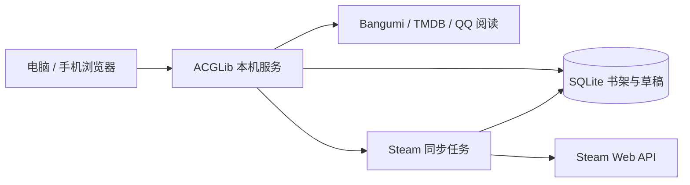

# 📚 ACGLib 私人书架

把看过的、读过的、玩过的作品，收进自己的书架。

ACGLib 是一款面向个人的 ACGN 作品管理工具，将作品检索、星级评分、批量整理与 Steam 游戏库同步放在同一个网页中。在 Windows 电脑上运行，电脑与同一 Wi-Fi 下的手机可以访问同一份收藏。

[项目简介](#-项目简介) · [核心能力](#-核心能力) · [系统架构](#️-系统架构) · [快速开始](#-快速开始) · [使用方式](#-使用方式)

---

## 📖 项目简介

小说、漫画、动画和游戏往往分散在不同的网站与平台。ACGLib 提供一个统一的私人书架，让作品资料与自己的评价放在一起：按名称查找封面和简介，再记录状态、评分、感想与观看链接。

书架采用深色界面，电脑端以侧栏组织入口，手机端通过底部导航访问。作品记录与导入草稿保存在本机 SQLite 数据库中；资料检索与封面加载通过网络连接对应目录服务。

## ✨ 核心能力

- 📚 **统一收藏** —— 在同一书架管理小说、漫画、动画、剧集、电影和游戏，按类型、状态与名称筛选。
- 🔎 **名称检索** —— 从 Bangumi、TMDB 和 QQ 阅读获取可用的作品资料与封面，也支持按名称创建自定义条目。
- ⭐ **个人评分** —— 5 颗星对应 10 分，每半颗星为 1 分；打分时空状态默认已完成，评分与状态均可手动清空。
- 📋 **批量整理** —— 粘贴作品清单、多选系列中的不同作品并分别记录；草稿自动保存，跨页填写后统一导入，也可复用名单。
- 🎮 **Steam 同步** —— 同步公开游戏库与累计游玩时长，保留个人评分、状态和感想，支持应用运行期间每日同步。
- 📱 **电脑与手机共用** —— 本机单进程运行，在同一局域网通过浏览器访问，便携包包含 Python 运行环境。

## 🏗️ 系统架构



Web 服务与后台同步任务在同一个 Python 进程内运行。作品资料从公开目录获取，个人评分、感想、观看链接与导入草稿写入本机数据库。

## 🛠️ 技术栈

| 领域 | 选型 |
| --- | --- |
| 服务端 | Python 3.12、Django、Waitress |
| 页面 | Django Templates、CSS、原生 JavaScript |
| 数据存储 | SQLite |
| 后台同步 | Celery 内存队列、数据库定时任务 |
| 作品资料 | Bangumi API、TMDB、QQ 阅读公开目录、Steam Web API |
| Windows 分发 | 内置 Python 的便携目录与 ZIP 压缩包 |

## 🚀 快速开始

环境要求：Windows、Python 3.12 和 [uv](https://docs.astral.sh/uv/)。以下命令使用 PowerShell。

```powershell
git clone https://github.com/ZorIgn/acgnlib.git
cd acgnlib
uv sync --locked
.\start.ps1 -OpenBrowser
```

启动后打开 [本机书架](http://127.0.0.1:8000/library/)，首次使用创建账户。手机连接同一 Wi-Fi，访问启动脚本显示的局域网地址；如需设置防火墙规则，运行 `允许手机访问.cmd`。

用完运行 `停止.cmd`。电脑休眠或关机期间，手机也无法访问书架。

### Windows 便携包

在源码目录执行：

```powershell
uv run python package.py
```

产物为 `dist/ACGLib-Windows.zip`。完整解压后双击 `启动.cmd` 即可运行。便携包的使用与备份方法见 [使用说明](使用说明.md)。

## 🧭 使用方式

### 搜索并加入作品

进入「添加作品」，选择类型并输入名称。每行一部，单份清单最多 500 行，分批展示检索结果。勾选候选作品后填写个人记录；同一组结果可以选择多部，分别打分。

混合类型清单可以这样填写：

```text
小说 | 仙逆 | 很喜欢
游戏 | 哈迪斯
动画 | 星际牛仔
```

纯名称使用上方选中的作品类型。也可粘贴 Bangumi、TMDB 条目链接进行匹配；第三方观看与阅读链接保存在个人记录中。

### 保存与复用清单

勾选、评分和文字记录自动保存到导入草稿。翻页、刷新或返回书架后，可在「添加作品 → 导入草稿」继续填写。「导入全部已选作品」会加入所有页面勾选的作品，已有记录保持原样。

「复用名单」将原清单填回输入框，修改或补充后可以再次检索。

### 同步 Steam

进入「Steam 同步」，填写 SteamID64 与自己的 Steam Web API 密钥，然后选择「保存并立即同步」。Steam 资料、游戏详情和游玩时长需允许公开读取。个人评分与通关状态由本人记录。

## 🗂️ 数据与资料来源

| 内容 | 来源或保存位置 |
| --- | --- |
| 小说、漫画、动画、剧集、游戏资料 | [Bangumi](https://github.com/bangumi/api) |
| 小说补充目录 | [QQ 阅读](https://book.qq.com/) |
| 电影资料 | [TMDB](https://www.themoviedb.org/) |
| Steam 游戏库与时长 | [Steam Web API](https://partner.steamgames.com/doc/webapi/IPlayerService#GetOwnedGames) |
| 私人书架、导入草稿与同步设置 | 本机 `src/db/` |
| 应用密钥 | 本机 `.env` |

公开目录可能存在缺项，检索不到的作品可按名称创建。第三方网站上的个人阅读与观看进度由本人记录。备份前停止应用，保留 `src/db/` 与 `.env`；这两处私人数据由 Git 忽略。

## 📚 延伸阅读

- [使用说明](使用说明.md)：启动、作品整理、Steam 同步与备份。
- [实现说明](docs/implementation.md)：本机部署方式与功能检查。

## 🙏 致谢与许可

ACGLib 基于 [Yamtrack v0.26.3](https://github.com/FuzzyGrim/Yamtrack/tree/v0.26.3)，沿用其作品记录模型与同步基础。

代码采用 [AGPL-3.0](LICENSE)。便携包内的 `source.zip` 及页面中的「源码」入口提供对应构建的应用源码，依赖许可证保留在分发目录中。
